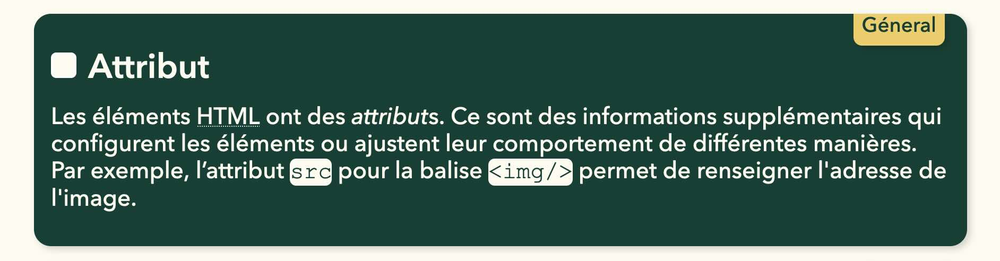
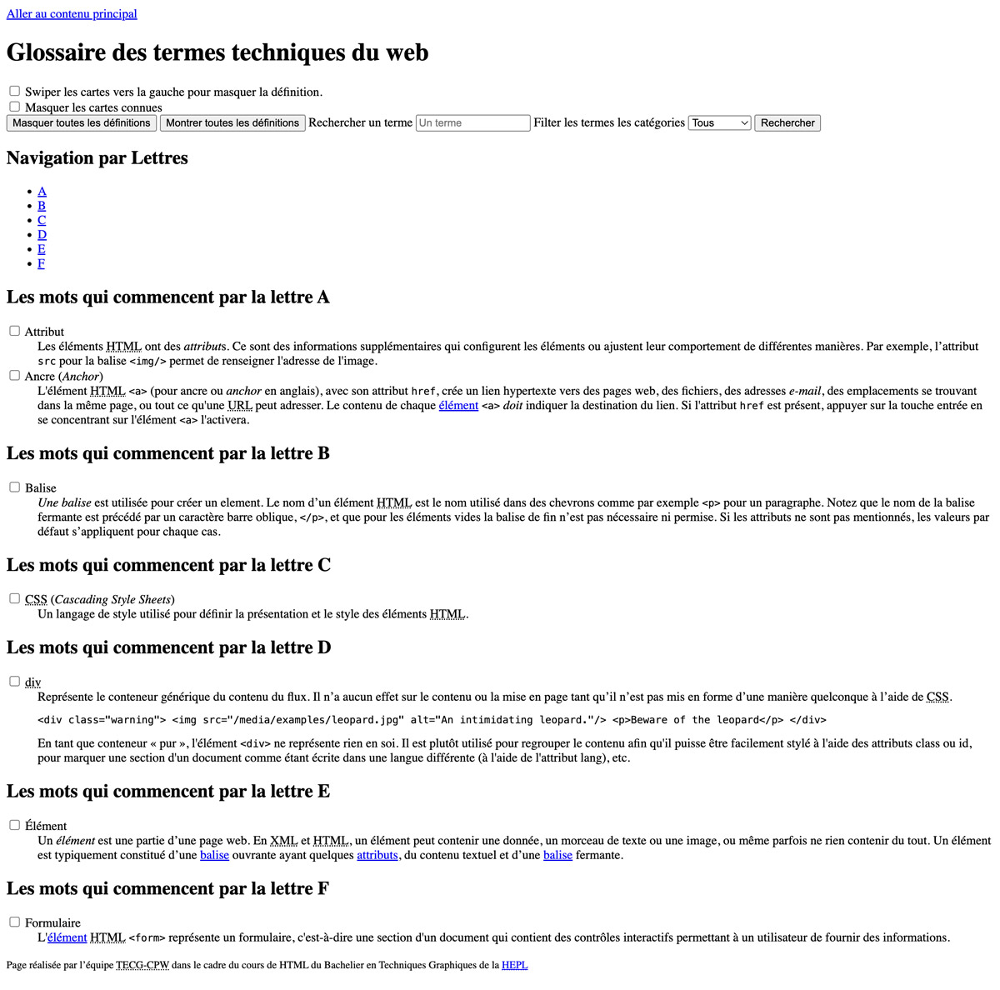
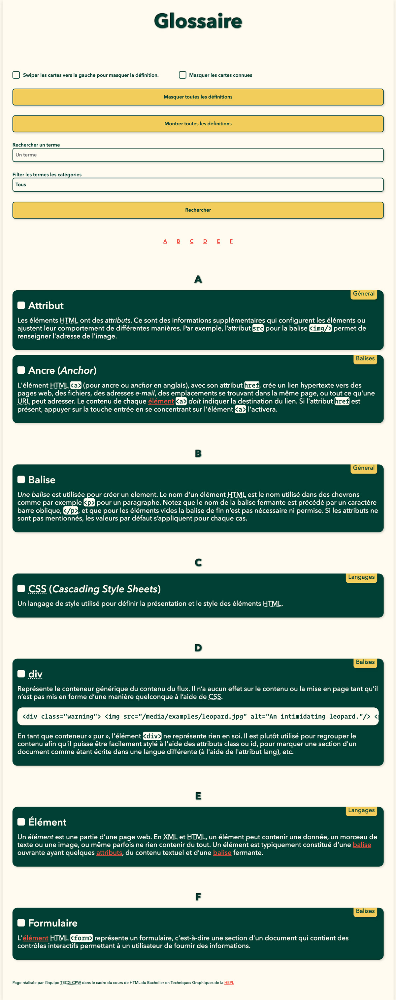
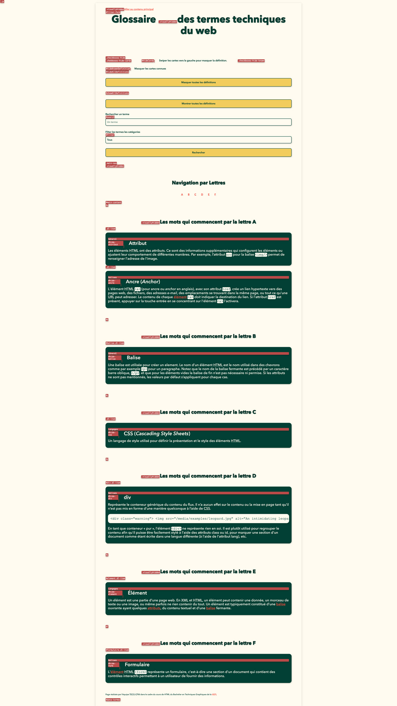
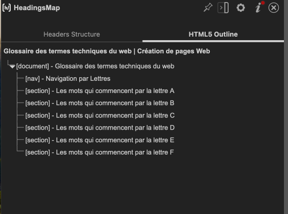
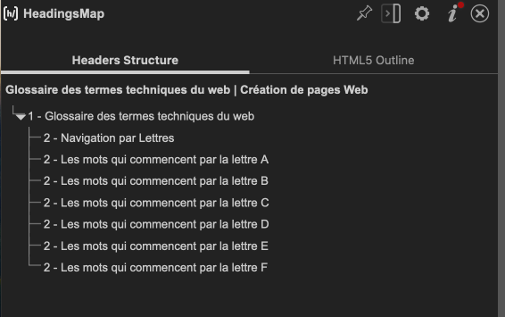

# Glossaire

## Introduction

> Glossaire des termes techniques

* * *

**"Glossaire"** est un projet pédagogique utilisé dans les cours de `HTML`/`CSS`.

**Note :** le cours est donné à la [HEPL](https://hepl.be/fr) de Liège, Belgique, une école francophone. Les instructions suivantes seront donc en français.

* * *

> Lors de vos cours de *web*, vous allez découvrir les langages HTML et CSS et les mettre en pratique pour apprendre à  créer des pages web.

## Objectifs

Mettez en pratique vos connaissances techniques et théoriques en créant un glossaire des termes techniques abordés en cours. Cet outil vous permettra de synthétiser les concepts, de vous exercer en HTML et de mémoriser les termes clés. Il pourrait aussi être adapté pour d'autres cours.

Grâce au formulaire géré par JavaScript, vous pouvez :
- swiper les cartes vers la gauche pour les masquer,
- cocher les cases à côté des termes pour cacher leurs définitions,
- et effectuer des recherches directement depuis le champ de recherche de la page.

## Consignes

- Une ébauche du contenu textuel de cette page se trouve dans le fichier `index.txt`.
- Le titre affiché dans la barre du navigateur doit être « Glossaire des termes techniques du web | Création de pages Web ».
- Description de la page : « Un exercice qui nous permet de revoir les nouveaux termes de vocabulaire découverts dans le cours de Création de pages Web. »
    - Mots-clés associés à la page : "Glossaire, Termes techniques du web, Création de pages Web, HTML, HEPL, TECG-CPW".
- Liez la feuille de style.
- [Liez le fichier JavaScript](https://developer.mozilla.org/fr/docs/Web/HTML/Element/script) depuis le `head` du document. N'oubliez pas de lui ajouter l'[attribut nécessaire](https://developer.mozilla.org/fr/docs/Web/HTML/Element/script#defer) pour que le navigateur exécute le script après l'analyse du document.
- Créez une navigation sur la page avec les lettres de l'alphabet. Notez que si une lettre n'a pas de section (avec son ID) associée, JavaScript retirera cet item de la navigation dynamiquement.
- Créez une section pour chaque lettre de l'alphabet. Chaque section doit avoir un identifiant correspondant à la lettre pour permettre des ancres nommées depuis la navigation.
    - Pour masquer visuellement du texte, utilisez la classe `visuallyhidden`, nécessaire pour les titres de sections (voir outline).
- À l'intérieur de chaque section, ajoutez une liste de termes web commençant par la lettre correspondante de la section.
- Chaque carte doit être construite comme suit :
    - Utilisez un *conteneur générique* pour chaque carte qui contiendra le *terme* et sa *définition*. Ce conteneur doit avoir la classe `dl-item` et un [attribut de données (data attribute)](https://developer.mozilla.org/fr/docs/Learn/HTML/Howto/Use_data_attributes) indiquant sa catégorie, par exemple : `data-cat="Général"`.
    - Placez le terme dans un label associé à sa checkbox.
      
    - Les termes ne doivent pas inclure de caractères spéciaux comme `)`, `(`, `;`, `<`, car cela pourrait causer des erreurs lors de la recherche.
    - La définition du terme doit être précise et enrichie des balises de phrasé adéquates.

## Rendus

**Sans CSS**&nbsp;:

**Avec CSS**&nbsp;:

Notez qu'il est nécessaire d'ajouter certaines classes pour obtenir ce rendu précis. Vous pouvez ajouter ces classes une fois que votre code HTML est terminé.

## Outlines
Voici un exemple d'outline avec quelques définitions seulement.

**HTML5**&nbsp;:

**HTML4**&nbsp;:

